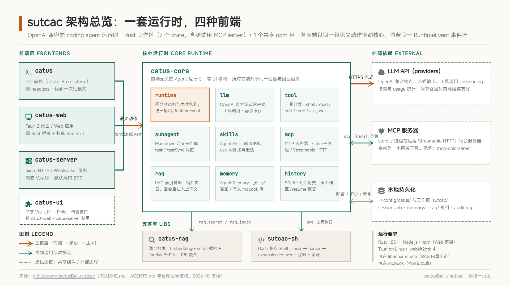

# sutcac



**一个兼容 OpenAI API 的编码 Agent 运行时，提供四种前端 —— 终端 TUI、Tauri 桌面/网页应用、HTTP/WebSocket 服务端，以及无头一次性模式 —— 并内置一个兼容 Bash 的 shell 与本地混合检索索引。**

[English](README.md) · [Agent / 贡献者指南](AGENTS.md)

---

## 特性

- **一套运行时，四种前端。** `catus-core` 负责会话状态、回合状态机、LLM/子 Agent 通道以及事件队列。TUI、Tauri 应用、HTTP 服务端与无头模式都通过相同的语义动作驱动它，并消费相同的 `RuntimeEvent`。
- **兼容 OpenAI 的流式 LLM 客户端**，支持工具调用、推理增量、用量统计，并保持仅追加（append-only）的请求路径以利于提示词前缀缓存。
- **丰富的内置工具集** —— `shell`、`read`、`edit`、`todo`、`use_skill`、`ask_user`、`ask_permission`、`task`/`taskSync`，以及 RAG 工具。
- **子 Agent（Subagents）**，以 Markdown 定义，可同步或异步派发。
- **Agent Skills**（[agentskills.io](https://agentskills.io/specification)），从磁盘发现并按需激活。
- **Agent Memory** —— 一个 mdbook 记忆库，每个回合前后由专门的记忆子 Agent 进行召回与写入。
- **MCP 客户端**，支持 stdio 子进程与远程 Streamable HTTP 服务器，每个服务器暴露为一个网关工具。
- **本地混合 RAG**（EmbeddingGemma 稠密通道 + Tantivy BM25，使用 RRF 融合），面向 `rust`/`ts` + Markdown 工作区。
- **一个简化的兼容 Bash 的 shell**（`sutcac-sh`），用于执行命令，带有基于标签与路径的权限模型和审计日志。
- **SQLite 会话历史**，支持按工作区 `/resume`。

## 仓库结构

| Crate / 包 | 说明 |
| --- | --- |
| `catus-core` | 与前端无关的 Agent 运行时：LLM 客户端、工具分发、子 Agent、MCP 客户端、RAG 管理、记忆、会话历史，以及回合状态机。零 UI 依赖。 |
| `catus` | TUI 前端二进制（ratatui + crossterm），同时提供无头 `--test` 模式。 |
| `catus-web` | Tauri 2 + Vue 3 桌面/网页前端（薄 Rust 桥接 + 共享 UI）。 |
| `catus-server` | 基于 axum + tower 的 HTTP/WebSocket 服务端前端，内嵌 Vue UI。 |
| `catus-ui` | 共享 npm 包：所有 Vue 组件、覆盖层、Pinia store、载荷类型，以及传输接口。 |
| `catus-rag` | 本地混合检索库（稠密 + BM25 + RRF）。 |
| `sutcac-sh` | 简化的兼容 Bash 的 shell（词法分析 → 语法分析 → 展开 → 执行）。同时作为 `catus-core` 使用的库。 |
| `mcp-calc-server` | 用于测试 MCP 客户端的独立计算器 MCP 服务器。 |

补充文档：[`AGENTS.md`](AGENTS.md)（深入实现指南）、[`config.toml.example`](config.toml.example)、[`docs/prompt-cache-investigation.md`](docs/prompt-cache-investigation.md)。

## 环境要求

- **Rust 1.85+**（工作区使用 edition 2024）。
- **Node.js + npm**（用于网页前端；使用 npm workspaces，在仓库根目录运行一次 `npm install`）。
- **Linux（仅 Tauri）：** 需要 `webkit2gtk-4.1` 开发包。
- **可选：** RAG 嵌入通道需要共享库 `libonnxruntime.so`（catus 可自动下载，见下文）；构建记忆库需要 `mdbook` 二进制（可选，缺失时跳过）。

## 快速开始

```bash
# 1. 构建整个工作区
cargo build

# 2. 配置 provider + model
mkdir -p ~/.config/catus
cp config.toml.example ~/.config/catus/config.toml
#   ...然后编辑 ~/.config/catus/config.toml 中的 api_key / base_url

# 3. 运行 TUI
cargo run -p catus

# ...或无头一次性模式
cargo run -p catus -- --test "解释这个仓库"
```

### 四种前端

```bash
# 终端 UI
cargo run -p catus
cargo run -p catus -- -w <dir>          # 针对另一个工作区运行

# 无头一次性模式（相同事件循环，无 TUI）
cargo run -p catus -- --test "prompt"

# Tauri 桌面/网页应用
cd catus-web && npm run tauri dev

# HTTP/WebSocket 服务端 + 内嵌网页 UI  (http://127.0.0.1:3117)
cargo run -p catus-server
cargo run -p catus-server -- -w <dir> --host 127.0.0.1 --port 4000

# 服务端 UI 热重载开发（将 /api 和 /ws 代理到 :3117）
cd catus-server/web && npm run dev
```

所有前端都接受 `-w/--workspace <dir>`：进程会在加载配置前切换到该目录，因此工作区配置（`.sutcac/config.toml`）、工作区的 agents/skills，以及会话历史记录的 cwd 都以此为基准解析。

TUI 按键：**Enter** 发送 · **Esc/Ctrl+C** 退出 · **Up/Down/PageUp/PageDown** 滚动 · **Home/End** 跳到首/尾。终端标签标题会反映状态，忙碌时任务栏会播放动画。

## 配置

配置统一存放在一个 XDG 基础目录下（`$XDG_CONFIG_HOME/catus/`，回退到 `~/.config/catus/`），首次启动时会从内嵌资源初始化。工作区文件 `./.sutcac/config.toml` 会叠加合并：标量/表字段逐键覆盖；`[[providers]]`（按 `name`）、`[[models]]`（按 `id`）、`[[mcp.servers]]`（按 `name`）逐条目合并。来自 `/model` 之类命令的修改会写回工作区配置（若存在），否则写入 XDG 配置。

| 路径 | 用途 |
| --- | --- |
| `config.toml` | 配置（见下文）。 |
| `agents/`、`skills/` | 已安装的 Agent 定义与 Skills。 |
| `catus.log` | 应用日志（固定路径；仅 `log_level` 可配置）。 |
| `audit.log` | Shell 审计日志（固定）。 |
| `history/sessions.db` | SQLite 会话历史（固定）；`/resume` 仅列出当前工作区的会话。 |
| `memory/` | 全局 Agent Memory mdbook 记忆库（固定，所有项目共享）。 |

### Providers 与 models

`catus` 将 API 供应商端点与模型配置分离：

```toml
[[providers]]
name = "opencode"
base_url = "https://api.opencode.example.com/v1"
api_key = "sk-..."
session_header = "x-opencode-session"   # 可选：每个会话携带一个稳定的会话 id

[[models]]
id = "kimi-k2"                # 作为 API 的 `model` 字段发送
name = "Kimi K2"              # UI 显示名（缺省回退到 id）
context_window = "128k"       # 0/缺省 = 未知；支持 "512k"/"1M"（基于 1024）
provider = "opencode"

[agent.models]                # 供 agent frontmatter 引用的能力层级
performance = "kimi-k2"       # 必填
# efficient = "gpt-4o-mini"   # 可选，缺省回退到 performance
```

`/model list` 列出已配置模型，`/model <name>` 按 id 或显示名切换，单独 `/model` 打开选择器。切换模型会重建 LLM 客户端，在下一个请求生效。

### MCP 服务器

```toml
[[mcp.servers]]
name = "calc"
command = "target/debug/mcp-calc-server"          # stdio（默认）

[[mcp.servers]]
name = "remote-calc"
transport = "streamable-http"
url = "https://mcp.example.com/calc"
[mcp.servers.headers]
Authorization = "Bearer sk-..."
```

每个已连接的服务器都作为**一个**网关工具暴露给模型，工具名为 `mcp_{server_name}`（非字母数字字符替换为 `_`），提供 `list` / `help` / `invoke` 动作。连接失败会被记录，健康的服务器仍会使用。

### RAG

```toml
[rag]
enabled = true
tools_enabled = true     # 注册 rag_search / rag_index
auto_inject = true       # 每轮用户输入后注入 top-k 上下文
inject_top_k = 8
```

索引位于各工作区的 `./.sutcac/rag/`。使用 `/rag index`（或 `/rag rebuild`）构建；`rag_search` 首次使用时触发惰性加载。嵌入通道需要共享库 `libonnxruntime.so` —— 运行 `catus --setup-ort`（或启用 `[rag].enabled`，它会通过 `catus-core/src/ort.rs` 自动准备 ORT）。

### 权限

`[shell].perm_mode` 接受 `allow_all`、`allow:<tags>`、`deny:<tags>` 及组合形式，以及按命令的 `allow1:<cmds>` / `deny1:<cmds>`。标签是任意字符串（`read`、`write`、`network`、`clipboard` ……）。工作区（`base_dir`）始终可读可写；其他目录默认拒绝，除非通过 `read_paths` / `write_paths` 或 `ask_permission` 工具授予。每条外部命令和重定向都会检查并记录到审计日志。

```toml
[shell]
perm_mode = "allow:read deny:network"
read_paths  = ["/home/user/data"]
write_paths = ["/home/user/projects"]
```

完整的带注释参考（含命令标签简写列表）见 [`config.toml.example`](config.toml.example)。

## 斜杠命令

| 命令 | 说明 |
| --- | --- |
| `/help [command] [subcommand]` | 显示总帮助或某命令的帮助。 |
| `/exit` | 退出。 |
| `/new [path]` | 开始新会话。 |
| `/config [set <key> <value>]` | 查看/编辑配置字段（网页 UI 提供三标签页编辑器）。 |
| `/resume [name]` | 从历史加载会话（单独 `/resume` 打开选择器）。 |
| `/status` | 模型、请求次数与 token 用量。 |
| `/model [list \| set-performance <model> \| set-efficient <model> \| name]` | 列出或切换模型。 |
| `/agent [list \| status \| use <name> <task> \| watch <id> \| close [id] \| disable/enable <name>]` | 管理子 Agent。 |
| `/skill [list \| use <name> \| disable/enable <name>]` | 管理 Agent Skills。 |
| `/memory [status \| on \| off \| path]` | 开关/查看 Agent Memory 子系统。 |
| `/permission [grant <tags> \| revoke <tags> \| reset]` | 调整主 Agent 的会话权限。 |
| `/auto` | 将会话切换为 `allow_all`（保留路径限制，清除会话授权）。 |
| `/mcp [list \| status \| disable/enable <name>]` | 查看/启用 MCP 服务器。 |
| `/rag [status \| index [path] \| rebuild \| auto on\|off \| path]` | 管理 RAG 索引。 |

`@agent_name <task>` 是 `/agent use <agent_name> <task>` 的简写。

## 内置工具

| 工具 | 说明 |
| --- | --- |
| `shell` | 在内嵌的 `sutcac-sh` 中执行命令，受权限模型约束。 |
| `read` | 读取文本文件（支持 1 基行偏移/行数限制）；输出带行号。 |
| `edit` | 精确的单次文本替换，并返回统一的 diff。 |
| `todo` | 仅主 Agent 可见的会话 TODO 列表。 |
| `use_skill` | 按名称激活一个 Agent Skill。 |
| `ask_user` | 向用户提出结构化问题（通过前端覆盖层作答）。 |
| `ask_permission` | 在拒绝后请求权限标签 / 目录访问。 |
| `task` / `taskSync` | 异步 / 阻塞式派发子 Agent。 |
| `completeTask` | 仅子 Agent：向父 Agent 返回最终结果。 |
| `rag_search` / `rag_index` | 查询 / 构建本地混合索引（启用时）。 |
| `mcp_{server}` | 通往某个 MCP 服务器工具的网关（`list`/`help`/`invoke`）。 |

## 子 Agent（Subagents）

子 Agent 是带有 YAML frontmatter 的 Markdown 文件（如 `.sutcac/agents/coder.md`）：

```markdown
---
name: coder
description: 实现聚焦的代码改动
model: efficient            # performance | efficient（经 [agent.models] 解析）
tools: [shell, read, edit, inherit]
permission: allow_all
skills: [commit, inherit]
---
你是一个专注的编码子 Agent。...
```

`main.md` 是必需文件，提供主系统提示词、工具与权限。`role: memory` 的 Agent 驱动 Agent Memory。子 Agent 不能再派发子 Agent；它们总是获得 `completeTask`，且从不获得 `task`/`taskSync`。`fork` 上下文继承父 Agent 的 env/vars/cwd；`create` 则独立开始。

## Agent Skills

Skills 是包含 `SKILL.md` 文件（带 `name`/`description` frontmatter）的目录，从 `./.sutcac/skills/`、`$XDG_CONFIG_HOME/catus/skills/` 和 `~/.config/catus/skills/` 发现（另有 `[agent].skill_paths`）。启动时仅加载元数据；模型通过 `use_skill` 激活技能，其正文会作为系统消息注入。

## Agent Memory

当设置 `[agent.memory].enabled` 时（需要一个 `role: memory` 的 Agent，默认已安装），catus 会在首个用户回合前运行一次**召回（recall）**（将相关记忆作为系统消息注入），并在每个回合后运行一次**写入（write）**（更新位于 `~/.config/catus/memory` 的 mdbook 记忆库）。通过 `enabled`、`auto_recall`、`auto_write` 配置，并用 `/memory` 按会话切换。

## 开发

```bash
cargo build                       # 整个工作区
cargo test --workspace            # 全部测试
cargo test -p sutcac-sh expand    # 单个模块的测试
cargo fmt                         # 提交前格式化
```

shell 部分也可独立运行：

```bash
cargo run -p sutcac-sh -- -c "echo hi"     # 一次性命令
cargo run -p sutcac-sh -- script.sh        # 运行脚本
cargo run -p sutcac-sh                     # 交互式 REPL
cargo run -p mcp-calc-server               # 计算器 MCP 服务器（stdio）
```

约定：每个源文件以 `//!` 文档注释开头，单元测试放在同文件的 `#[cfg(test)] mod tests` 中。多文件模块使用 `foo.rs` + `foo/` 布局（不使用 `mod.rs`）。

## 安全提示

- **切勿提交** `.sutcac/config.toml` 或 `~/.config/catus/config.toml` —— 它们包含明文 API key。
- Agent 会针对真实文件系统执行任意 shell 命令；请设置合适的 `perm_mode`，仅在可信环境中运行。HTTP 服务器默认绑定 `127.0.0.1` 且**不带认证** —— 仅供本地使用。
